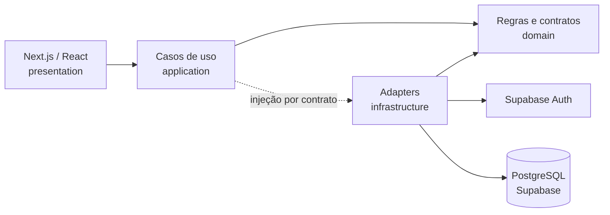

# FinControl

**Gestão financeira pessoal com foco em clareza, segurança e decisões de engenharia explicáveis.**

[](https://github.com/JrDaliessi/fin_control/actions/workflows/ci.yml)

[Testar aplicação](https://fin-control-two.vercel.app) · [Portfólio](https://curriculo-web-ten.vercel.app/) · [Visita técnica guiada](docs/showcase/README.md) · [Arquitetura](architecture.md) · [Decisões arquiteturais](adr/README.md) · [Roadmap](roadmap.md)

> O endereço publicado é um ambiente de demonstração. Não use dados financeiros reais. As credenciais da conta compartilhada não são armazenadas no repositório.

### Acesso para avaliação

O link público abre a tela de autenticação. As informações da conta preparada para recrutadores ficam centralizadas na seção FinControl do [portfólio](https://curriculo-web-ten.vercel.app/#portfolio), sem duplicar a senha no Git. A evolução recomendada é uma sessão demo de um clique, isolada e restaurada periodicamente.

## O produto

O FinControl transforma receitas, despesas, contas e períodos financeiros em uma visão consolidada que ajuda a entender o que aconteceu com o dinheiro. A interface é uma PWA mobile-first e combina indicadores, visualizações e alternativas textuais acessíveis.

Hoje o projeto demonstra:

- autenticação por e-mail e sessão protegida;
- contas, categorias e transações persistentes;
- dashboard com saldo, receitas, despesas e evolução financeira;
- gráficos de linha e candles financeiros, sem finalidade de trading;
- períodos financeiros adaptativos e URLs compartilháveis;
- expansão de gráficos e tabelas equivalentes para acessibilidade;
- extrato contextual, volume movimentado e insights determinísticos;
- experiência responsiva, temas claro/escuro/sistema e instalação PWA;
- isolamento por usuário com PostgreSQL, RLS, constraints e grants mínimos.

## Por que este repositório existe

Além do produto funcionando, este repositório registra **por que** cada mudança existe e **como** ela foi validada. Requisitos, ADRs, migrations, testes e releases formam uma cadeia rastreável:

```text
problema → requisitos → decisão arquitetural → testes → implementação → validação → release
```

Para uma avaliação rápida, comece pela [visita técnica guiada](docs/showcase/README.md). Ela aponta os arquivos mais relevantes sem exigir a leitura de toda a documentação de engenharia.

Contribuições e critérios de apresentação de commits/PRs estão em [`CONTRIBUTING.md`](CONTRIBUTING.md).

## Arquitetura atual

O projeto usa **Feature-Based + Clean Architecture leve**. A regra central é manter interface, casos de uso, domínio e detalhes de infraestrutura separados.



- `src/app`: rotas e composição do App Router;
- `src/features`: módulos por domínio, separados por camada;
- `src/shared`: componentes e utilitários transversais;
- `supabase/migrations`: evolução versionada do banco;
- `supabase/tests/database`: contratos pgTAP de schema, RLS e comportamento;
- `adr`: decisões arquiteturais e trade-offs.

Detalhes e restrições estão em [`architecture.md`](architecture.md).

## Próxima evolução: API NestJS

A direção aprovada é evoluir incrementalmente para:

```text
Next.js → API NestJS → PostgreSQL no Supabase
```

Essa arquitetura **ainda não está implementada**. Antes da extração do backend, o trabalho começa pelo inventário verificável do modelo atual: entidades, relacionamentos, PKs, FKs, constraints, índices, regras de negócio e fronteiras de autorização.

A migração seguirá um recorte vertical por vez, mantendo o aplicativo utilizável e evitando uma reescrita integral. O plano, alternativas e riscos estão documentados em:

- [Roadmap da evolução do backend](docs/showcase/backend-evolution-roadmap.md);
- [ADR 0023 — extração incremental para API NestJS](adr/0023-incremental-nestjs-api-extraction.md).

## Stack atual

| Área | Tecnologias |
| --- | --- |
| Web | Next.js 16, React 19, TypeScript 6, Tailwind CSS |
| Dados e identidade | Supabase Auth, PostgreSQL, RLS, migrations SQL |
| Visualização | Apache ECharts com adapter local e fallback textual |
| Validação | Jest, Testing Library, pgTAP, ESLint, TypeScript |
| Entrega | GitHub Actions, Vercel e PWA |

As versões exatas ficam em [`package.json`](package.json), e o contrato vigente da stack está em [`project-stack.md`](project-stack.md).

## Onde observar as decisões técnicas

| Interesse | Ponto de partida |
| --- | --- |
| Fronteiras entre camadas | [`architecture.md`](architecture.md) |
| Modelo e integridade dos dados | [`database-model.md`](database-model.md) |
| Contratos entre módulos | [`module-contracts.md`](module-contracts.md) |
| Decisões e alternativas | [`adr/`](adr/) |
| Features e critérios de aceite | [`docs/features/`](docs/features/) |
| Migrations e segurança do banco | [`supabase/migrations/`](supabase/migrations/) |
| Testes de RLS e schema | [`supabase/tests/database/`](supabase/tests/database/) |
| Releases verificadas | [`docs/releases/`](docs/releases/) |
| Quality gates | [`quality-gates.md`](quality-gates.md) |

## Qualidade e segurança

O pipeline verifica lint, tipos, testes, auditoria de dependências e build. Comportamentos relevantes seguem Validation First e TDD, incluindo testes de domínio, aplicação, apresentação e banco.

No banco, as fronteiras críticas usam RLS por proprietário, funções `SECURITY INVOKER`, privilégios explícitos e relacionamentos tenant-safe. Isso reduz risco, mas não representa uma promessa de segurança absoluta; hardenings pendentes permanecem documentados de forma transparente.

Consulte [`SECURITY.md`](SECURITY.md) antes de testar ou reportar uma vulnerabilidade.

## Executar localmente

Pré-requisitos: Node.js 22 e npm 11.

```bash
npm install
```

Crie o ambiente local a partir do exemplo:

```powershell
Copy-Item .env.example .env.local
```

Preencha apenas as variáveis públicas do seu próprio projeto Supabase:

```dotenv
NEXT_PUBLIC_SUPABASE_URL=https://seu-projeto.supabase.co
NEXT_PUBLIC_SUPABASE_PUBLISHABLE_KEY=sua-chave-publicavel
```

Depois execute:

```bash
npm run dev
```

A aplicação ficará disponível em `http://localhost:3000`.

Nunca envie `.env.local`, chaves secretas ou `SUPABASE_SERVICE_ROLE_KEY` ao Git. Variáveis `NEXT_PUBLIC_*` são incorporadas ao cliente e devem conter somente valores publicáveis.

## Comandos úteis

```bash
npm run dev          # desenvolvimento
npm run lint         # lint sem warnings
npm run type-check   # análise TypeScript
npm run test:ci      # suíte Jest sequencial
npm run build        # build de produção
npm audit            # auditoria de dependências
```

## Estado do desenvolvimento

O FinControl evolui em small releases. O estado operacional atual fica em [`project-context.md`](project-context.md), o trabalho priorizado em [`backlog.md`](backlog.md) e o histórico concluído em [`docs/releases/`](docs/releases/).

Funcionalidades planejadas são identificadas como futuras e não são apresentadas como entregues. A publicação do código também não transforma automaticamente o ambiente de demonstração em produto pronto para uso com dados reais.

## Autor

Desenvolvido por [Amauri Daliessi](https://curriculo-web-ten.vercel.app/) como um case aberto de engenharia de produto, arquitetura de software e evolução incremental. Veja também o [perfil no GitHub](https://github.com/JrDaliessi).
