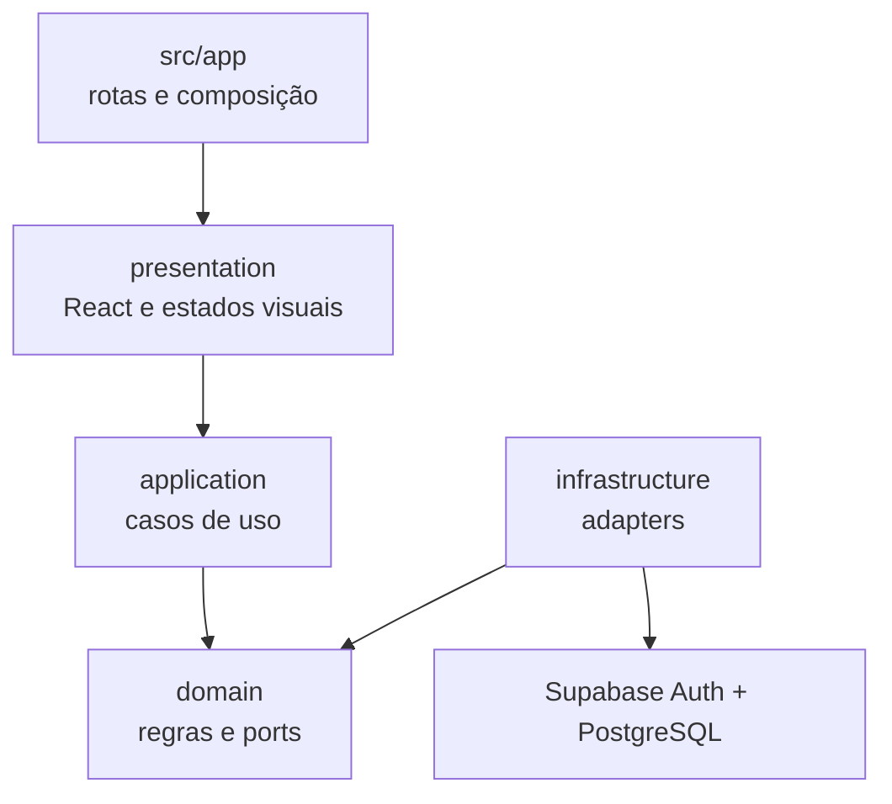

# Visita técnica guiada — FinControl

Esta página foi desenhada para uma avaliação objetiva do projeto. Em poucos minutos é possível observar o produto, a arquitetura, as decisões e a estratégia de qualidade sem percorrer todo o histórico operacional.

## Roteiro de 5 minutos

### 1. Entenda o produto

- Abra a [demonstração](https://fin-control-two.vercel.app).
- Consulte o [portfólio](https://curriculo-web-ten.vercel.app/#portfolio) para as informações centralizadas de acesso demonstrativo.
- Observe a experiência mobile-first, os indicadores, a navegação e as visualizações financeiras.
- Não use dados financeiros reais; o endereço publicado é demonstrativo.

### 2. Veja as fronteiras arquiteturais

- [`architecture.md`](../../architecture.md) define as responsabilidades de `presentation`, `application`, `domain` e `infrastructure`.
- [`src/features/financial-analytics/`](../../src/features/financial-analytics/) mostra um exemplo completo de organização por feature.
- [`module-contracts.md`](../../module-contracts.md) registra os ports e casos de uso entre módulos.

Pergunta que a estrutura responde: **como trocar UI, banco ou transporte sem mover regra financeira para o framework?**

### 3. Confira decisões e trade-offs

- [`adr/`](../../adr/) contém as decisões arquiteturais.
- [`adr/0015-financial-balance-candles.md`](../../adr/0015-financial-balance-candles.md) explica por que candles foram adaptados para finanças pessoais sem semântica de trading.
- [`adr/0019-contextual-candle-statement.md`](../../adr/0019-contextual-candle-statement.md) registra o extrato contextual sob demanda.
- [`adr/0023-incremental-nestjs-api-extraction.md`](../../adr/0023-incremental-nestjs-api-extraction.md) apresenta a próxima evolução do backend e suas alternativas.

### 4. Inspecione dados e segurança

- [`database-model.md`](../../database-model.md) documenta entidades, constraints e isolamento.
- [`supabase/migrations/`](../../supabase/migrations/) contém migrations SQL forward-only.
- [`supabase/tests/database/`](../../supabase/tests/database/) verifica schema, grants, RLS, comportamento e performance.
- [`SECURITY.md`](../../SECURITY.md) explica limites do ambiente público e reporte responsável.

Pergunta que esses artefatos respondem: **como o isolamento entre usuários continua existindo depois que a requisição deixa a interface?**

### 5. Verifique qualidade e entrega

- [`.github/workflows/ci.yml`](../../.github/workflows/ci.yml) executa os quality gates.
- [`quality-gates.md`](../../quality-gates.md) define o contrato de qualidade e segurança.
- [`docs/releases/`](../releases/) registra entregas validadas e seus limites.
- [`docs/features/`](../features/) liga requisitos, specs, testes e estado de cada feature.

## Arquitetura em uma frase

O Next.js compõe a experiência; casos de uso orquestram o fluxo; o domínio mantém regras determinísticas; adapters de infraestrutura acessam Supabase Auth e PostgreSQL por contratos internos.

## Capacidades já demonstráveis

| Capacidade | Evidência no repositório |
| --- | --- |
| Modelagem financeira | `domain-model.md`, `database-model.md` e migrations |
| Clean Architecture pragmática | `architecture.md` e organização de `src/features` |
| Segurança multiusuário | RLS, grants, FKs tenant-safe e pgTAP |
| Visualização acessível | linha, candles, tabela equivalente e expansão |
| TDD e Validation First | specs, testes RED/GREEN e quality gates |
| Entrega incremental | backlog, ADRs, PRs e release records |
| UX mobile-first | shell responsivo, diálogos adaptativos e PWA |

## Evolução planejada

O próximo eixo arquitetural será uma extração incremental para uma API NestJS, mantendo PostgreSQL no Supabase. O plano começa pela documentação do modelo real e não por uma conversão automática do código existente.

Leia o [roadmap da evolução do backend](backend-evolution-roadmap.md) para ver etapas, riscos, critérios de entrada e evidências esperadas.

## Limites declarados

- A API NestJS está planejada, não implementada.
- O ambiente publicado é demonstrativo e não deve receber dados reais.
- Open Finance e ações financeiras autônomas não fazem parte da entrega atual.
- Recursos futuros não são usados como evidência de capacidade já entregue.
- Credenciais, dados da conta demo e segredos operacionais não pertencem ao repositório.

## Para uma análise mais profunda

1. escolha uma decisão em [`adr/`](../../adr/);
2. siga o requisito correspondente em [`docs/features/`](../features/);
3. encontre o teste e a implementação em `src/features` ou `supabase/tests`;
4. confirme o gate e os limites no respectivo release record.

Essa trilha é intencional: o repositório não apresenta apenas o resultado, mas também contexto, alternativas, validação e consequências.

Conheça também o [portfólio de Amauri Daliessi](https://curriculo-web-ten.vercel.app/).
